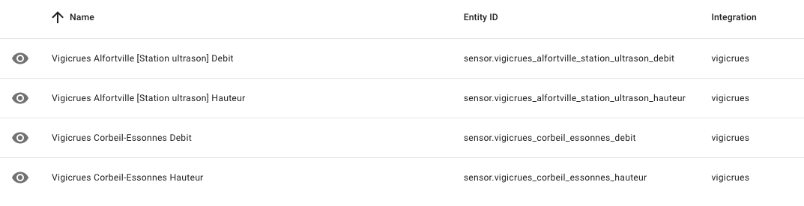
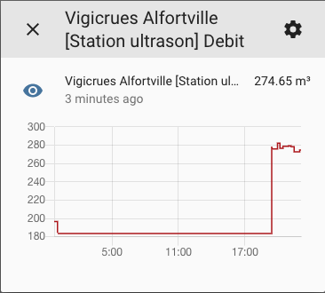

# Vigicrues Integration for Home Assistant

### Installation

Copy the `vigicrues` folder into `<config_dir>/custom_components/vigicrues/`.

### Configuration

Add the following to your `configuration.yaml` file:

```yaml
# Example configuration.yaml entry

sensor:
  - platform: vigicrues
    stations:
      - S516001001
      - S5160010XX
```

station can be found on https://www.vigicrues.gouv.fr/

### Screenshots



